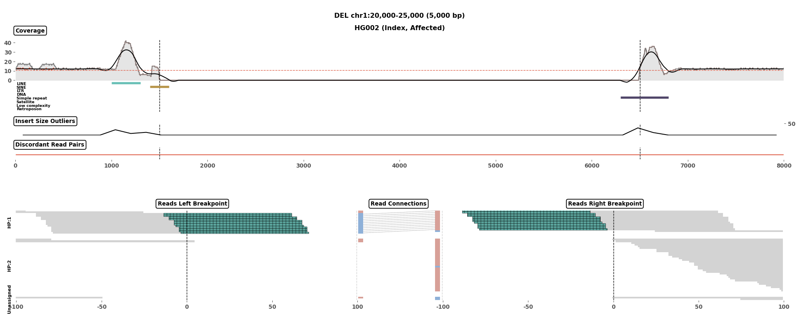

# cuban

[](https://github.com/burgshrimps/cuban/actions/workflows/ci.yml)
[](LICENSE)
[](pyproject.toml)

**cuban** renders publication-quality, multi-panel figures of structural
variants (SVs) directly from BAM files. Given an SV (type + coordinates) and
one or more samples, it draws every read-level line of evidence in one
image: coverage, repeat elements, insert-size outliers, discordant read
pairs, and the individual read alignments around both breakpoints —
including haplotype grouping for phased BAMs.



*A homozygous 5 kb deletion on synthetic data: coverage drops to zero
between the breakpoints, insert-size outliers peak at both, split reads
(teal) pile up at the junctions, and the read panel is grouped into HP:1 /
HP:2 / unassigned haplotype bands.
See [docs/interpreting-figures.md](docs/interpreting-figures.md) for how to
read every track.*

- **Caller-agnostic** — works from coordinates or any SV VCF; five SV types
  (DEL, DUP, INS, INV, BND)
- **Multi-sample** — stack trios or whole families, short-read (`ill`) and
  long-read (`pb`) together
- **Haplotype-aware** — reads with `HP` tags are grouped into labelled
  haplotype bands, with a per-read strand barcode
- **Fast coverage** — uses [mosdepth](https://github.com/brentp/mosdepth)
  when available (run automatically and cached), falling back to pysam
- **Scales to large SVs** — coverage is binned automatically above 100 kb,
  so multi-megabase variants render in seconds

## Installation

With conda (recommended — includes mosdepth):

```bash
git clone https://github.com/burgshrimps/cuban.git
cd cuban
conda env create -f environment.yml
conda activate cuban
```

Or with pip (Python ≥ 3.10; install
[mosdepth](https://github.com/brentp/mosdepth) separately for fast
coverage, otherwise cuban falls back to a slower built-in path):

```bash
pip install git+https://github.com/burgshrimps/cuban.git
```

Verify the install:

```bash
cuban --version
```

### Repeat annotation (optional, recommended)

The repeat-element track needs a RepeatMasker table. Download the prepared
hg38 table (~40 MB) once:

```bash
cuban-fetch-repeats
```

It is stored in `~/.cuban/` and picked up automatically. Without it, cuban
still runs and simply leaves the repeat track empty (`--no-repeats`
silences the warning). For other genomes, build a table from UCSC with
[scripts/build_repeats.py](scripts/build_repeats.py), e.g.
`python scripts/build_repeats.py --genome hg19 -o hg19_repeats.tsv.gz`, and
pass it via `--repeats`.

## Quickstart

The repo ships a small synthetic example (a homozygous 5 kb deletion):

```bash
cuban --sv-type DEL --chrom chr1 --start 20000 --end 25000 \
      --sample EXAMPLE:ill:examples/data/example.bam \
      --repeats examples/data/repeats.tsv \
      --out examples/output/example.png
```

Or render every record of a VCF in one go (one PNG per record, named
`<ID>.png`; already-rendered variants are skipped, so a batch can resume):

```bash
cuban --vcf examples/data/example.vcf --outdir examples/output \
      --sample EXAMPLE:ill:examples/data/example.bam \
      --repeats examples/data/repeats.tsv
```

## Usage

### Samples

Each `--sample` is a colon-separated spec (so paths must not contain `:`):

```
name:tech:bam[:baseline_cov[:family_status[:disease_status]]]
```

- `tech` — `ill` (short-read) or `pb` (long-read). Long-read samples omit
  the insert-size/orientation tracks.
- `baseline_cov` — the chromosome-average coverage drawn as the reference
  line; `auto` (default) derives it from the BAM itself.
- `family_status` / `disease_status` — annotate the figure title
  (defaults: `index`, `affected`).

BAMs must be indexed (`samtools index sample.bam`). Repeat `--sample` for
a trio or family — each sample becomes one figure block:

```bash
cuban --sv-type DEL --chrom chr1 --start 1234500 --end 1239800 \
      --sample proband:ill:proband.bam:auto:index:affected \
      --sample mother:ill:mother.bam:auto:mother:unaffected \
      --sample father:ill:father.bam:auto:father:unaffected \
      --out trio.png
```

### Breakpoint junctions (BND)

Translocations render as two independent loci side by side:

```bash
cuban --bnd --chrom chr1 --start 20000 --end 20001 \
      --chrom-b chr5 --start-b 90000 --end-b 90001 \
      --sample proband:ill:sample.bam --out bnd.png
```

In VCF mode, BND records are handled automatically (all four breakend
bracket notations).

### Useful options

Run `cuban --help` for everything; the ones you'll actually reach for:

- `--padding` — context around the SV; defaults to an adaptive
  `max(1500, size/10)` bp.
- `--window` — read-panel window around each breakpoint (default 100 bp).
- `--max-reads` — cap reads per panel on deep data (default 5000, seeded).
- `--bin-size` — coverage bin width; automatic above 100 kb.
- `--cache-dir` — where mosdepth output is cached (default `~/.cuban/coverage`;
  reused across variants of the same BAM, which makes VCF batches fast).

## Python API

```python
from pathlib import Path
from cuban import cuban
from cuban.repeats import load_repeats

rep_df = load_repeats()          # or load_repeats("path/to/repeats.tsv.gz")
samples = {
    "SAMPLE_001": {
        "technology": "ill",             # 'ill' or 'pb'
        "bam_name": "SAMPLE_001.bam",    # must be indexed
        "baseline_cov": "auto",          # or an explicit float
        "family_status": "index",
        "disease_status": "affected",
    },
}
cuban(samples, rep_df, sv_type="DEL",
      chrom="chr1", start=1_234_500, end=1_239_800,
      padding=1500, outfile="SAMPLE_001_DEL.png")
```

`cuban_bnd()` works analogously for breakpoint pairs. A worked, executed
notebook is at [examples/cuban_examples.ipynb](examples/cuban_examples.ipynb).

## Documentation

- [Interpreting cuban figures](docs/interpreting-figures.md) — what every
  track and read color means
- [Architecture](docs/architecture.md) — data flow, sample-dict contract,
  coverage backend, figure layout
- [Domain rules](docs/domain.md) — thresholds, color tables, per-SV-type
  processing

## Tests

```bash
pip install -e '.[test]'
pytest tests/
```

## Citing

cuban accompanies our paper (Genome Biology, in press) — see
[CITATION.cff](CITATION.cff). A Zenodo DOI for the archived release will be
added on publication.

## License

[GPL-3.0-or-later](LICENSE)
