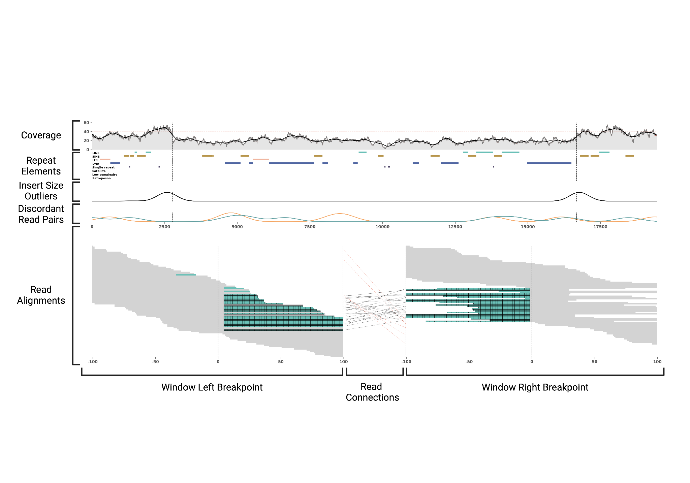
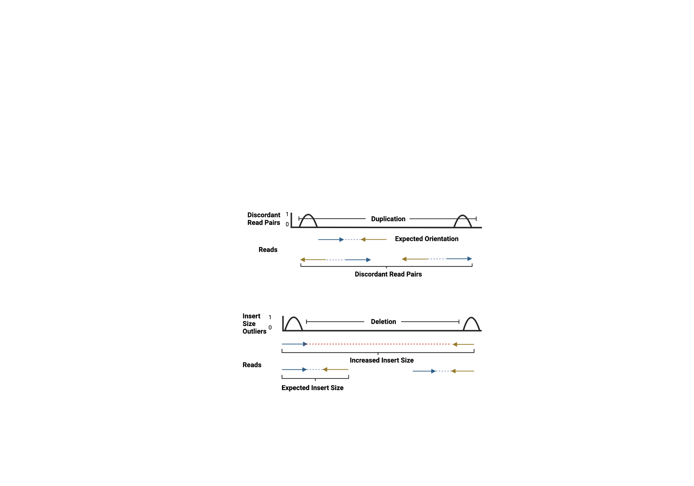

# cuban

[](https://github.com/burgshrimps/cuban/actions/workflows/ci.yml)
[](LICENSE)
[](pyproject.toml)

**cuban** is a tool for manually inspecting the sequencing evidence behind
structural variant (SV) calls. Given an SV (type + coordinates) and one or
more BAM files, it renders all the read-level evidence for the call in a
single multi-panel image: coverage, repeat elements, insert-size outliers,
discordant read pairs, and the individual read alignments around both
breakpoints, including haplotype grouping for phased BAMs. cuban is
caller-agnostic (works from coordinates or any SV VCF), supports all five
SV types (DEL, DUP, INS, INV, BND), and stacks any number of samples,
short-read and long-read together, so trios and cohorts can be reviewed
side by side.



## Installation

With conda (recommended, includes mosdepth):

```bash
git clone https://github.com/burgshrimps/cuban.git
cd cuban
conda env create -f environment.yml
conda activate cuban
```

Or with pip (Python 3.10+; install
[mosdepth](https://github.com/brentp/mosdepth) separately for fast
coverage, otherwise cuban falls back to a slower built-in method):

```bash
pip install git+https://github.com/burgshrimps/cuban.git
```

## Usage

*On first use cuban downloads the RepeatMasker table (~40 MB, one time) to
`~/.cuban/` and reuses it from then on.*

**Single variant, single sample:**

```bash
cuban --sv-type DEL --chrom chr2 --start 1234500 --end 1239800 \
      --sample proband:proband.bam \
      --out proband_del.png
```

**Single variant, multiple samples** (repeat `--sample`; each sample
becomes one block of the figure):

```bash
cuban --sv-type DEL --chrom chr2 --start 1234500 --end 1239800 \
      --sample proband:proband.bam \
      --sample mother:mother.bam \
      --sample father:father.bam \
      --out trio_del.png
```

**VCF, single sample** (one PNG per record, named `<ID>.png`;
already-rendered variants are skipped, so a batch can resume):

```bash
cuban --vcf variants.vcf --outdir plots/ \
      --sample proband:proband.bam
```

**VCF, multiple samples:**

```bash
cuban --vcf variants.vcf --outdir plots/ \
      --sample proband:proband.bam \
      --sample mother:mother.bam \
      --sample father:father.bam
```

**Visualizing BNDs**: breakpoint junctions render as two independent loci
side by side. In VCF mode, BND records (all four breakend bracket
notations) are handled automatically; in single variant mode, pass both
loci explicitly:

```bash
cuban --bnd --chrom chr1 --start 20000 --end 20001 \
      --chrom-b chr5 --start-b 90000 --end-b 90001 \
      --sample proband:proband.bam --out bnd.png
```

### Command line options

| Flag | Default | Explanation |
|---|---|---|
| `--sample NAME:BAM` | required, repeatable | Sample to render; each sample becomes one figure block. The BAM must be indexed (`samtools index`) and its path must not contain `:`. The sequencing technology (short-read vs long-read) is inferred from the read lengths. |
| `--tech SAMPLE:TECH` | inferred | Set the technology explicitly: `sr` (short-read) or `lr` (long-read). Long-read samples omit the insert-size and orientation tracks. Repeatable, one per sample. |
| `--baseline-cov SAMPLE:COV` | chromosome mean of the BAM (via mosdepth) | Override the baseline coverage drawn as the horizontal reference line, e.g. `proband:32.5`. Repeatable, one per sample. |
| `--sv-type TYPE` | required (single variant mode) | One of `DEL`, `DUP`, `INS`, `INV`, `BND`. |
| `--chrom` / `--start` / `--end` | required (single variant mode) | SV coordinates (1-based, inclusive). |
| `--bnd` | off | Render two independent loci side by side (implies `--sv-type BND`). |
| `--chrom-b` / `--start-b` / `--end-b` | required for BND | Coordinates of the second locus. |
| `-o` / `--out` | required (single variant mode) | Output PNG path. |
| `--vcf` | - | VCF/BCF of SVs for multi variant mode (BND breakends are parsed automatically). Requires `--outdir`. |
| `--outdir` | required with `--vcf` | Output directory for multi variant mode. |
| `--repeats` | auto-downloaded hg38 table | RepeatMasker TSV[.gz] with UCSC rmsk columns (genoName/genoStart/genoEnd/repClass). Build one for another genome with [scripts/build_repeats.py](scripts/build_repeats.py). |
| `--no-repeats` | off | Leave the repeat track empty. |
| `--padding` | `max(1500, size/10)` bp | Context drawn around the SV. |
| `--window` | 100 bp | Read-panel window around each breakpoint. |
| `--max-reads` | 5000 | Cap on reads per read panel (seeded downsampling on deep data). |
| `--bin-size` | auto: 1 up to 100 kb, then ~size/2000 | Coverage bin width for large SVs. |
| `--cache-dir` | `~/.cuban/coverage` | Where mosdepth output is cached and reused across renders of the same BAM. |
| `--no-collapse-ins` | off | Do not collapse insertion runs into a single column. |
| `--sv-len` | from coordinates | Explicit SV length shown in the title. |
| `--version` | - | Print the version and exit. |

## Interpreting cuban plots

Every figure stacks several evidence tracks for one SV, one block per
sample. For Illumina samples there are five tracks: coverage (with repeat
elements), insert size outliers, discordant read pairs, and the read
alignments around both breakpoints. Long-read samples omit the insert-size
and discordant-pair tracks, which only apply to paired-end data.

### Coverage

Read coverage across the whole SV with padding on both sides. Breakpoints
are indicated by vertical black dashed lines. The average coverage of the
chromosome is indicated by a horizontal red dashed line. The gray area
counts all reads; the black line counts only reads with mapping quality of
20 or more, so a gap between the two exposes regions supported only by
ambiguous alignments. A deletion shows as a drop below the baseline between
the breakpoints, a duplication as a gain; inversions and insertions usually
leave coverage flat.

### Repeat elements

Repetitive sequence affects read alignment and variant detection, so all
annotated repeat elements near the SV are drawn under the coverage track,
one row per class:

| Repeat class    | Color                    |
|-----------------|--------------------------|
| LINE            | teal (`#6ac0b7`)         |
| SINE            | tan (`#b7954b`)          |
| LTR             | orange (`#f0b6a0`)       |
| DNA             | blue (`#5066a2`)         |
| Simple_repeat   | purple (`#504669`)       |
| Satellite       | red (`#df624c`)          |
| Low_complexity  | green (`#61856b`)        |
| Retroposon      | dark green (`#2f7155`)   |

### Insert size outliers

The insert size is the distance between the two mates of a read pair. Read
pairs spanning a deletion (or duplication) appear to have a larger insert
than the sequencing library was prepared with, so peaks of insert-size
outliers (insert > 1 kb) at both breakpoints support a DEL/DUP call. This
signal is only informative for variants larger than roughly 400-500 bp.



### Discordant read pairs

With paired-end sequencing the first read of a pair is expected to align to
the forward strand and its mate to the reverse strand. Deviations indicate
an SV. The track shows the distribution of read pairs aligning in
reverse-forward (dark blue), reverse-reverse (orange), and forward-forward
(cadet blue) orientation; the dashed red line shows reads whose mate maps
to a different chromosome. Duplications typically produce reverse-forward
pairs around the breakpoints; inversions produce reverse-reverse and
forward-forward pairs. For deletions this track is not informative.

### Read alignments

The bottom track shows the individual reads in two windows (default
100 bp) around the two breakpoints. When reads carry `HP` tags (phased
BAMs), they are grouped into labelled HP:1 / HP:2 / unassigned haplotype
bands, and a per-read strand barcode (blue forward, red reverse) is drawn
next to each panel. Colors encode the CIGAR operations of each read:

| Appearance | Meaning |
|---|---|
|  light gray | normally aligned read |
|  dark gray | mapping quality < 30, the read aligns to multiple positions in the reference |
|  blue | small deleted segment within the read |
|  tan | small inserted segment within the read |
|  teal | soft-clipped read: only part of the read aligns, the clipped part (teal) can indicate a breakpoint |
|  red | hard-clipped read: as above, but the clipped bases are not stored in the BAM |
|   black grid overlay | split read: parts of the read align to two different positions |
|  dark blue overlay | read pair in reverse-forward orientation |
|  orange overlay | read pair in reverse-reverse orientation |
|  cadet blue overlay | read pair in forward-forward orientation |

### Read connections

Dashed lines drawn between the two breakpoint windows connect related
reads. Black dashed lines join the two segments of one split read; split
reads bridging both breakpoints are strong evidence that the breakpoints
are placed correctly. Red dashed lines join the two mates of a read pair
(or the same read appearing in both windows when the variant is small
enough for the windows to overlap); for larger variants they play the same
role as the insert-size track, showing pairs that span the variant.

## Python API

```python
from pathlib import Path
from cuban import cuban
from cuban.repeats import load_repeats

rep_df = load_repeats()          # auto-downloads the hg38 table on first use
samples = {
    "SAMPLE_001": {
        "technology": "ill",             # short-read 'ill' / long-read 'pb';
                                         # cuban.utils.infer_technology(bam) infers it
        "bam_name": "SAMPLE_001.bam",    # must be indexed
        "baseline_cov": "auto",          # or an explicit float
    },
}
cuban(samples, rep_df, sv_type="DEL",
      chrom="chr1", start=1_234_500, end=1_239_800,
      padding=1500, outfile="SAMPLE_001_DEL.png")
```

`cuban_bnd()` works analogously for breakpoint pairs. A worked, executed
notebook is at [examples/cuban_examples.ipynb](examples/cuban_examples.ipynb).
